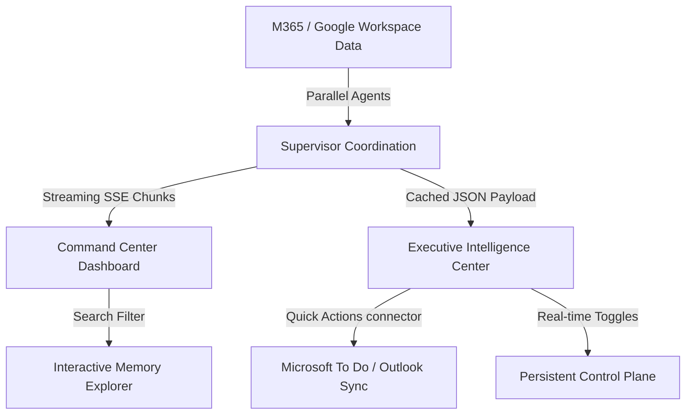

# 🚀 WorkSphere AI

**The High-Performance Sovereign Executive Layer for Autonomous Workplace Analysis.**

[](https://www.python.org/)
[](https://developer.mozilla.org/en-US/docs/Web/HTML)
[](LICENSE.txt)
[](#performance-engine)

WorkSphere AI is a premium, multi-agent command center that compiles unstructured enterprise communications into a structured, dependency-aware workplace intelligence suite. It functions as a digital **Chief of Staff**, orchestrating a fleet of specialized analytical agents (Email, Meeting, Task, and Research Analysts) in parallel to compile streaming briefings, track decisions, monitor stakeholder sentiment, and suggest instant quick actions with sub-second latency.

> [!IMPORTANT]
> **Performance Optimized**: This version of WorkSphere AI has been hardened with parallel `asyncio` execution, real-time Server-Sent Events (SSE), cached structured JSON payloads, and dynamic LLM fallback routers for a fluid, lag-free executive experience.

---

### 🏛️ Main Features

- **Parallel Analyst Fleet**: Deploys specialized sub-agents concurrently (Communications, Meeting, Workload, and Knowledge Analysts) using `asyncio.gather` to minimize latency.
- **Two-Call Synthesis Pipeline**: Computes a streaming markdown Chief of Staff briefing, followed by a non-streaming structured JSON data extraction.
- **Executive Intelligence Center**: Renders decision tracking, approval queues, risk radars, stakeholder sentiment tables, and upcoming deadlines dynamically.
- **Token Caching & SSE**: Caches structured JSON payloads immediately and streams them down in real-time as a terminal Server-Sent Event (SSE).
- **Interactive Memory Explorer**: An interactive SVG Knowledge Graph representing connected organizations, documents, tasks, and meetings with visual linkage filters.
- **Persistent Control Plane**: System settings, model selections, and analyst fleet toggles are saved and persisted dynamically.

---

### ⚡ Performance Engine

WorkSphere AI is built for speed and reliability. Recent architectural optimizations include:

- **Parallel Supervisor Pipeline**: Concurrently executes all agents using Python asynchronous I/O, yielding consolidated analysis in sub-second times.
- **Structured Payload Caching**: Stores parsed agent JSON results directly in local/Redis caches, allowing the dashboard UI to render instantly on page load.
- **SSE Stream Multiplexing**: Delivers both real-time text briefing chunks and structured JSON states in a single network stream, removing the need for secondary fetch requests.
- **Resilient Model Fallbacks**: Instantly routes requests through fallback LLMs (Groq primary, Gemini models fallback) if API rate limits or service outages occur.

---

### 📦 Installation & Setup

1. **Backend Environment & Server**:
   ```bash
   $ cd backend
   $ pip install -r requirements.txt
   $ python -m uvicorn main:app --host 127.0.0.1 --port 8000
   ```
   *Required `.env` keys*: `MICROSOFT_CLIENT_ID`, `MICROSOFT_CLIENT_SECRET`, `MICROSOFT_TENANT_ID`, `GROQ_API_KEY`, `GEMINI_API_KEY`, `SUPABASE_URL`, `SUPABASE_KEY`.

2. **Frontend Layer**:
   The frontend is built using Vanilla HTML/JS with glassmorphism CSS, and is served directly by the FastAPI backend. Access the pages after startup at:
   *   `/` — Landing page with Microsoft/Google OAuth integrations.
   *   `/dashboard` — Command Center with live Briefing streaming.
   *   `/executive_intelligence` — Chief of Staff Decision and Risk Radar dashboard.
   *   `/agent_operations` — Operations monitoring and live SSE terminal activity feeds.
   *   `/memory_explorer` — Interactive SVG Knowledge Graph browser.
   *   `/control_plane` — Settings configurations.

---

### 🔄 System Workflow



---

### 🔐 Licensing

WorkSphere AI is distributed under the Apache Software License. See the [LICENSE.txt](./LICENSE.txt) file in the release for details.

### 👋 Feedback

Please drop [Maheswaran](https://github.com/mahesh-0103) a note with any feedback. Your input drives the evolution of our sovereign intelligence.

---

*WorkSphere AI • Your Strategic Executive Layer • v1.3.0 (Perf-Boost) • 2026*
