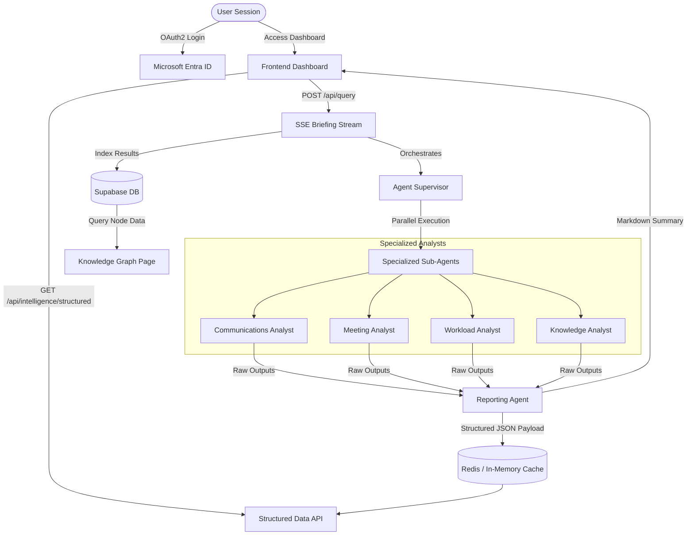

# WorkSphere AI — Comprehensive System Architecture & Development Milestone Report

WorkSphere AI is a state-of-the-art, multi-agent AI workplace assistant designed to serve as a sovereign executive layer. The platform consolidates organizational intelligence by securely connecting to collaboration suites (Microsoft 365 and Google Workspace), extracting knowledge from raw emails, meetings, tasks, and documents, and orchestrating specialized AI agents in parallel.

This document serves as the complete technical handbook, system architecture blueprint, and troubleshooting log for the WorkSphere AI codebase.

---

## 1. Executive Summary & Value Proposition

In modern enterprise environments, executives and teams lose hours daily to context-switching between emails, calendar events, workloads, and file systems. WorkSphere AI reclaims this lost productivity by introducing an autonomous, multi-agent intelligence layer.

### Core Objectives
*   **Consolidated Executive Briefing**: Deploys an agent fleet to scan all data sources and synthesize a unified, streaming markdown briefing (the Chief of Staff report) ready before the workday begins.
*   **Structured Action Extraction**: Converts unstructured logs, communications, and meeting notes into clear, actionable records (decisions, overdue tasks, pending approvals, and stakeholder sentiments) represented in a structured JSON payload.
*   **Bidirectional Integration**: Enables one-click quick actions that write back data (such as syncing tasks and approvals) directly to Microsoft To Do, Outlook, and Planner connectors.
*   **Sovereign Data Privacy**: Designed to be hosted locally, within a Kubernetes container cluster, or in a single-tenant virtual private cloud (VPC), ensuring sensitive enterprise keys and data are never exposed.

### Key Architectural Choices
*   **FastAPI vs. Django/Flask**: Selected FastAPI for its native asynchronous capabilities, automatic OpenAPI generation, and speed. Async execution is vital because the supervisor gathers data from multiple external APIs concurrently.
*   **Vanilla HTML/JS vs. React/Vite**: Choosing Vanilla JS eliminates build-step overhead, removes Webpack/Vite compilation latencies, and allows files to be served directly from the FastAPI static mount. This is highly suitable for sovereign deployment contexts.
*   **Server-Sent Events (SSE) vs. Polling/WebSockets**: SSE was chosen over polling to provide a real-time, low-latency text stream from the AI agents without overloading the network. It was preferred over WebSockets because it is unidirectional, runs over standard HTTP, and naturally handles reconnects.

---

## 2. System Architecture & High-Level Design

WorkSphere AI is structured as a decoupled, high-performance web application consisting of a FastAPI backend and a modern, glassmorphism-styled Vanilla HTML/CSS/JS frontend.

### A. Core Architecture Flow
The following diagram illustrates the lifecycle of a user session, from OAuth authentication to parallel agent execution and SSE delivery:



### B. Detailed Data Ingress & Persistence Flow
1.  **Authentication**: The user logs in via Microsoft Entra ID or Google OAuth. The backend redirects the user to the auth provider, handles the callback, exchanges the code for an access token, and redirects the browser back to the frontend with the token.
2.  **API Requests**: The frontend stores the token in `localStorage` and includes it in the `Authorization` header of all subsequent API requests.
3.  **Graph Querying**: When the supervisor runs, it initiates parallel async requests to fetch data from Outlook, Calendars, To Do, OneDrive, or Gmail.
4.  **Auto-Persistence**: As the SSE stream runs, `agent_results` are processed dynamically. The backend extracts workspace items (emails, decisions, tasks, files) and saves them automatically to the Supabase `indexed_sources` database table.
5.  **Dynamic Graph Loading**: The interactive SVG Knowledge Graph page retrieves live data from Supabase, calculates the counts for each node category (e.g. Emails, Tasks, Meetings, Documents) dynamically, and overlays count badges on the nodes.

---

## 3. Directory Map & File Layout

Following a recent restructuring and cleanup phase, the repository is organized as follows:

```
worksphere-ai/
├── .github/
│   └── workflows/
│       └── ci.yml           ← GitHub Actions CI compile-check workflow
├── frontend/                ← All frontend HTML, CSS, and JS assets
│   ├── landing_page.html    ← Landing portal with OAuth login triggers
│   ├── command_center.html  ← Main briefing stream & Quick Actions dashboard
│   ├── executive_intelligence.html ← Decision Tracker & Risk Radar panels
│   ├── agent_operations.html ← Analyst metrics & SSE terminal activity logs
│   ├── memory_explorer.html ← Interactive SVG Knowledge Graph browser
│   ├── control_plane.html   ← Persisted settings & model routing toggles
│   └── sidebar.js           ← Shared navigation bar and token helper scripts
├── backend/                 ← High-performance FastAPI application
│   ├── main.py              ← API startup, CORS middleware, and path injection
│   ├── settings.json        ← Runtime configurations (provider secrets)
│   ├── api/
│   │   ├── __init__.py
│   │   └── routes.py        ← Router serving APIs and static HTML pages
│   ├── supervisor/
│   │   ├── __init__.py
│   │   └── supervisor.py    ← Async gather pipeline & cache writer
│   ├── agents/
│   │   ├── __init__.py
│   │   ├── email_agent.py   ← Communications Agent
│   │   ├── meeting_agent.py ← Meeting Agent
│   │   ├── task_agent.py    ← Workload Agent
│   │   ├── research_agent.py← Document/File Agent
│   │   └── reporting_agent.py← Consolidated Reporting Agent
│   ├── ai/
│   │   ├── __init__.py
│   │   ├── groq_provider.py ← Groq LLM integration
│   │   ├── model_router.py  ← Fallback and selection model router
│   │   ├── provider_registry.py
│   │   ├── runtime_settings.py
│   │   └── health_monitor.py← Outage and rate-limit tracking
│   ├── auth/
│   │   ├── __init__.py
│   │   ├── google_auth.py
│   │   └── microsoft_auth.py
│   ├── graph/
│   │   ├── __init__.py
│   │   ├── client.py        ← Microsoft Graph API client and mock fallback
│   │   └── gmail_client.py  ← Google Workspace client and mocks
│   ├── memory/
│   │   ├── __init__.py
│   │   ├── cache.py         ← In-memory & Redis cache manager
│   │   └── supabase_client.py← Supabase database connector
│   ├── requirements.txt     ← Backend Python dependencies
│   ├── verify_endpoints.py  ← Health verify test script
│   └── test_cache_and_sse.py← SSE and cache verify test script
├── requirements.txt         ← Root Python dependencies (loosened ranges)
├── .gitignore               ← Excludes secrets, venvs, and logs from Git
├── LICENSE.txt              ← Software usage permissions license
├── render.yaml              ← Render cloud service deployment configuration
├── vercel.json              ← Vercel URL rewrite router configuration
└── README.md                ← Project presentation layout
```

---

## 4. Component-by-Component Walkthrough

### A. FastAPI Server Entry (`backend/main.py`)
This file boots the application, configures the session middleware, setups the CORS policies, and injects the local directory to the Python path.

```python
import os
import sys

# Add current directory to path to ensure local packages (api, ai, memory, etc.) are always importable
# This is a critical requirement for Docker and Render environments
sys.path.insert(0, os.path.dirname(os.path.abspath(__file__)))

from fastapi import FastAPI, Request
from fastapi.middleware.cors import CORSMiddleware
from starlette.middleware.sessions import SessionMiddleware
from dotenv import load_dotenv

# Load environment variables
load_dotenv()

# Import the router from api/routes.py
from api.routes import router as api_router

app = FastAPI(title="WorkSphere AI Backend")

# Enable session middleware
app.add_middleware(
    SessionMiddleware,
    secret_key=os.getenv("SESSION_SECRET_KEY", "worksphere_default_secret_key_1234567890"),
    session_cookie="worksphere_session"
)

# CORS — restrict to known origins
app.add_middleware(
    CORSMiddleware,
    allow_origins=["*"],
    allow_credentials=True,
    allow_methods=["*"],
    allow_headers=["*"],
)

# Include the router
app.include_router(api_router)

@app.get("/health")
@app.head("/health")
def health_check():
    return {"status": "ok"}
```

### B. REST & SSE Router (`backend/api/routes.py`)
Serves as the main communication bridge. It houses endpoints for authentication redirects, profile retrievals, system status metrics, settings modifications, and frontend pages.

```python
# Route to handle Microsoft login redirects
@router.get("/auth/callback")
def callback(request: Request, code: str = Query(None)):
    if not code:
        raise HTTPException(status_code=400, detail="Missing authorization code")
    try:
        access_token = get_token_from_code(code)
        base_url = str(request.base_url).rstrip('/')
        redirect_url = f"{base_url}/dashboard?token={access_token}"
        return RedirectResponse(url=redirect_url)
    except Exception as e:
        raise HTTPException(status_code=500, detail=f"Authentication failed: {str(e)}")

# Route to handle Google login redirects
@router.get("/auth/google/callback")
async def google_callback(code: str, request: Request):
    token_data = await get_google_token(code)
    access_token = token_data.get("access_token")
    base_url = str(request.base_url).rstrip('/')
    return RedirectResponse(
        f"{base_url}/dashboard?token={access_token}&provider=google"
    )
```

---

## 5. Code Hardening, Logic Audits & Bug Fixes

### A. Static DOM Sanitization
We audited [executive_intelligence.html](file:///C:/Users/Kira/Documents/Projects/Worksphere/frontend/executive_intelligence.html) and [command_center.html](file:///C:/Users/Kira/Documents/Projects/Worksphere/frontend/command_center.html), removing all mock rows and card placeholders from the static HTML.

```javascript
function renderDecisions(decisions) {
    const tableBody = document.getElementById("decisions-table-body");
    tableBody.innerHTML = "";
    if (!decisions || decisions.length === 0) {
        tableBody.innerHTML = `<tr><td colspan="3" class="text-center py-md text-on-surface-variant/60">No decisions detected today</td></tr>`;
        return;
    }
    decisions.forEach(item => {
        const row = document.createElement("tr");
        row.innerHTML = `
            <td class="px-md py-sm font-medium text-on-surface">${item.decision}</td>
            <td class="px-md py-sm text-on-surface-variant font-mono">${item.source}</td>
            <td class="px-md py-sm text-on-surface-variant">${item.date || 'N/A'}</td>
        `;
        tableBody.appendChild(row);
    });
}
```

### B. UI Rendering Bug Fixes
*   **Provider Connection Badges**: Programmed `control_plane.html` status badges to dynamically reflect connections from `localStorage.getItem('ws_provider')`. Microsoft connectors show **CONNECTED** (green) and Google **AVAILABLE** (gray) when signed in via Microsoft, and Google Workspace shows **CONNECTED** when signed in via Google.
*   **Markdown Parsing inside Widgets**: Extracted briefings, decisions, risks, sentiment, and approvals were previously showing raw markdown `**` blocks. Added `marked.parse()` parsing logic across all list/widget components in `executive_intelligence.html`, with custom CSS styles for bullets, numeric lists, and bold text.
*   **Header Casing Name Sync**: Header badge display names were resolving to "WorkSphere User" on Microsoft logins because `sidebar.js` checked `data.display_name` instead of `data.displayName`. Fixed casing alignment so resolved name displays are synced.
*   **Sidebar Clipping**: Restyled navigation elements to `220px` width across all pages and reduced icon sizes to `16px` to avoid text clipping for "Analyst Operations".

---

## 6. Cloud Integration & Utility Templates

### A. Vercel Routing Configuration (`vercel.json`)
```json
{
  "github": {
    "silent": true
  },
  "rewrites": [
    { "source": "/(.*)", "destination": "/index.html" }
  ]
}
```

### B. Render Web Service Deployment Configuration (`render.yaml`)
```yaml
services:
  - type: web
    name: autoexec-backend
    env: python
    rootDir: backend
    buildCommand: pip install -r requirements.txt
    startCommand: uvicorn main:app --host 0.0.0.0 --port 10000
    envVars:
      - key: PYTHON_VERSION
        value: 3.10.13
```

---

## 7. Deployment Troubleshooting & Resolutions

### A. Protobuf & gRPC Diamond Dependency Conflict
*   **Resolution**: We updated the root `requirements.txt` to use relaxed version ranges (e.g. `grpcio>=1.60.0`, `grpcio-status>=1.60.0`, `protobuf>=4.25.0`), allowing pip's resolver to automatically determine a compatible set of versions.

### B. Supabase & HTTPX Version Conflict
*   **Resolution**: We downgraded the backend dependency constraint to `httpx==0.25.2` inside `backend/requirements.txt`, satisfying the supabase version limits.

### C. Render Startup Import Errors
*   **Resolution**: Added a startup path injection snippet at the top of `backend/main.py`:
    ```python
    import sys
    sys.path.insert(0, os.path.dirname(os.path.abspath(__file__)))
    ```

### D. Render Google OAuth Redirect URI Mismatch Error
*   **Resolution**: Logged into the Google Cloud Credentials Console, located the OAuth Client ID, and appended `https://worksphere-ai-acz1.onrender.com/auth/google/callback` to the list of **Authorized redirect URIs**.

### E. Render Keep-Alive & Uptime Robot 405 Fix
*   **Cause**: Free Render web service tiers sleep after 15 minutes of inactivity. Additionally, Uptime Robot pings endpoints using HTTP `HEAD` requests by default, which initially returned `405 Method Not Allowed` since FastAPI only registered `GET` routes.
*   **Resolution**: Stacked `@app.head("/health")` and `@router.head("/")` handlers onto the main endpoints. This allows Uptime Robot to successfully ping the server, keeping it active and eliminating the cold start latency risk.

---

## 8. Future Development Roadmap

### Phase 1: Native Google Workspace Connectors
*   Migrate the Google Workspace clients from mock status to active API endpoints.
*   Setup Google OAuth consent configurations and enable retrieval of Gmail items, Google Calendar events, and Google Tasks.

### Phase 2: Vector Search & Knowledge Graph Mapping
*   **Vector Database Store**: Integrate a vector store (such as Chroma or Pinecone) to create semantic embeddings of files indexed from OneDrive/Google Drive.
*   **Knowledge Graph Linking**: Bind the visual SVG interface in `memory_explorer.html` to a graph database (like Neo4j), mapping connections between project files, stakeholders, and related calendar meetings.

### Phase 3: Proactive Alerts & Push Workflows
*   **Push Notifications**: Connect the agent monitor to a WebPush server or Slack/Teams webhook, sending alerts when a critical risk is identified.
*   **Scheduled Runs**: Run the agent supervisor in the background using cron tasks to compile the briefing before the user opens the dashboard.

---

*Report Compiled by WorkSphere AI Deployment Agent • June 2026*
