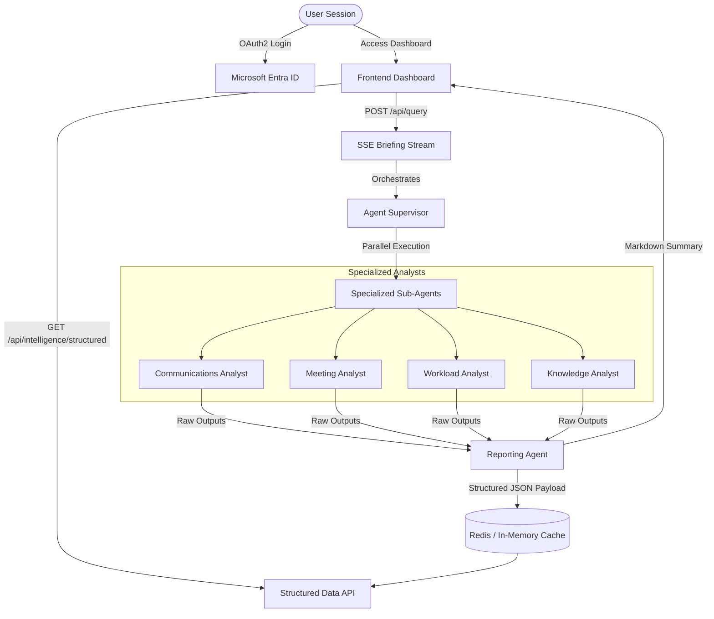

# WorkSphere AI — Comprehensive System Architecture & Development Milestone Report

WorkSphere AI is a state-of-the-art, multi-agent AI workplace assistant designed to serve as a sovereign executive layer. The platform consolidates organizational intelligence by securely connecting to collaboration suites (Microsoft 365 and Google Workspace), extracting knowledge from raw emails, meetings, tasks, and documents, and orchestrating specialized AI agents in parallel.

This document serves as the complete technical handbook, system architecture blueprint, and troubleshooting log for the WorkSphere AI codebase.

---

## 1. Executive Summary & Value Proposition

In modern enterprise environments, executives and teams lose hours daily to context-switching between emails, calendar events, workloads, and file systems. WorkSphere AI reclaims this lost productivity by introducing an autonomous, multi-agent intelligence layer.

### Core Objectives
*   **Consolidated Executive Briefing**: Deploys an agent fleet to scan all data sources and synthesize a unified, streaming markdown briefing (the Chief of Staff report) ready before the workday begins.
*   **Structured Action Extraction**: Converts unstructured logs, communications, and meeting notes into clear, actionable records (decisions, overdue tasks, pending approvals, and stakeholder sentiments) represented in a structured JSON payload.
*   **Bidirectional Integration**: Enables one-click quick actions that write back data (such as syncing tasks and approvals) directly to Microsoft To Do, Outlook, and Planner connectors.
*   **Sovereign Data Privacy**: Designed to be hosted locally, within a Kubernetes container cluster, or in a single-tenant virtual private cloud (VPC), ensuring sensitive enterprise keys and data are never exposed.

### Key Architectural Choices
*   **FastAPI vs. Django/Flask**: Selected FastAPI for its native asynchronous capabilities, automatic OpenAPI generation, and speed. Async execution is vital because the supervisor gathers data from multiple external APIs concurrently.
*   **Vanilla HTML/JS vs. React/Vite**: Choosing Vanilla JS eliminates build-step overhead, removes Webpack/Vite compilation latencies, and allows files to be served directly from the FastAPI static mount. This is highly suitable for sovereign deployment contexts.
*   **Server-Sent Events (SSE) vs. Polling/WebSockets**: SSE was chosen over polling to provide a real-time, low-latency text stream from the AI agents without overloading the network. It was preferred over WebSockets because it is unidirectional, runs over standard HTTP, and naturally handles reconnects.

---

## 2. System Architecture & High-Level Design

WorkSphere AI is structured as a decoupled, high-performance web application consisting of a FastAPI backend and a modern, glassmorphism-styled Vanilla HTML/CSS/JS frontend.

### A. Core Architecture Flow
The following diagram illustrates the lifecycle of a user session, from OAuth authentication to parallel agent execution and SSE delivery:



### B. Detailed Data Ingress Flow
1.  **Authentication**: The user logs in via Microsoft Entra ID or Google OAuth. The backend redirects the user to the auth provider, handles the callback, exchanges the code for an access token, and redirects the browser back to the frontend with the token.
2.  **API Requests**: The frontend stores the token in `localStorage` and includes it in the `Authorization` header of all subsequent API requests.
3.  **Graph Querying**: When the supervisor runs, it initiates parallel async requests to fetch data from Outlook, Calendars, To Do, OneDrive, or Gmail.

---

## 3. Directory Map & File Layout

Following a recent restructuring and cleanup phase, the repository is organized as follows:

```
worksphere-ai/
├── .github/
│   └── workflows/
│       └── ci.yml           ← GitHub Actions CI compile-check workflow
├── frontend/                ← All frontend HTML, CSS, and JS assets
│   ├── landing_page.html    ← Landing portal with OAuth login triggers
│   ├── command_center.html  ← Main briefing stream & Quick Actions dashboard
│   ├── executive_intelligence.html ← Decision Tracker & Risk Radar panels
│   ├── agent_operations.html ← Analyst metrics & SSE terminal activity logs
│   ├── memory_explorer.html ← Interactive SVG Knowledge Graph browser
│   ├── control_plane.html   ← Persisted settings & model routing toggles
│   └── sidebar.js           ← Shared navigation bar and token helper scripts
├── backend/                 ← High-performance FastAPI application
│   ├── main.py              ← API startup, CORS middleware, and path injection
│   ├── settings.json        ← Runtime configurations (provider secrets)
│   ├── api/
│   │   ├── __init__.py
│   │   └── routes.py        ← Router serving APIs and static HTML pages
│   ├── supervisor/
│   │   ├── __init__.py
│   │   └── supervisor.py    ← Async gather pipeline & cache writer
│   ├── agents/
│   │   ├── __init__.py
│   │   ├── email_agent.py   ← Communications Agent
│   │   ├── meeting_agent.py ← Meeting Agent
│   │   ├── task_agent.py    ← Workload Agent
│   │   ├── research_agent.py← Document/File Agent
│   │   └── reporting_agent.py← Consolidated Reporting Agent
│   ├── ai/
│   │   ├── __init__.py
│   │   ├── groq_provider.py ← Groq LLM integration
│   │   ├── model_router.py  ← Fallback and selection model router
│   │   ├── provider_registry.py
│   │   ├── runtime_settings.py
│   │   └── health_monitor.py← Outage and rate-limit tracking
│   ├── auth/
│   │   ├── __init__.py
│   │   ├── google_auth.py
│   │   └── microsoft_auth.py
│   ├── graph/
│   │   ├── __init__.py
│   │   ├── client.py        ← Microsoft Graph API client and mock fallback
│   │   └── gmail_client.py  ← Google Workspace client and mocks
│   ├── memory/
│   │   ├── __init__.py
│   │   ├── cache.py         ← In-memory & Redis cache manager
│   │   └── supabase_client.py← Supabase database connector
│   ├── requirements.txt     ← Backend Python dependencies
│   ├── verify_endpoints.py  ← Health verify test script
│   └── test_cache_and_sse.py← SSE and cache verify test script
├── requirements.txt         ← Root Python dependencies (loosened ranges)
├── .gitignore               ← Excludes secrets, venvs, and logs from Git
├── LICENSE.txt              ← Software usage permissions license
├── render.yaml              ← Render cloud service deployment configuration
├── vercel.json              ← Vercel URL rewrite router configuration
├── clean_null_bytes.py      ← Byte cleaning utility
├── tempCodeRunnerFile.python← Temporary runner helper
└── README.md                ← Project presentation layout
```

---

## 4. Component-by-Component Walkthrough

### A. FastAPI Server Entry (`backend/main.py`)
This file boots the application, configures the session middleware, setups the CORS policies, and injects the local directory to the Python path.

```python
import os
import sys

# Add current directory to path to ensure local packages (api, ai, memory, etc.) are always importable
# This is a critical requirement for Docker and Render environments
sys.path.insert(0, os.path.dirname(os.path.abspath(__file__)))

from fastapi import FastAPI, Request
from fastapi.middleware.cors import CORSMiddleware
from fastapi.responses import JSONResponse
from starlette.middleware.sessions import SessionMiddleware
from dotenv import load_dotenv

# Load environment variables
load_dotenv()

# Import the router from api/routes.py
from api.routes import router as api_router

app = FastAPI(title="WorkSphere AI Backend")

# Enable session middleware
app.add_middleware(
    SessionMiddleware,
    secret_key=os.getenv("SESSION_SECRET_KEY", "worksphere_default_secret_key_1234567890"),
    session_cookie="worksphere_session"
)

# CORS — restrict to known origins
app.add_middleware(
    CORSMiddleware,
    allow_origins=["*"],  # Wildcard or dynamically populated origins
    allow_credentials=True,
    allow_methods=["*"],
    allow_headers=["*"],
)

# Include the router
app.include_router(api_router)

@app.get("/health")
def health_check():
    return {"status": "ok"}
```

### B. REST & SSE Router (`backend/api/routes.py`)
Serves as the main communication bridge. It houses endpoints for authentication redirects, profile retrievals, system status metrics, settings modifications, and frontend pages.

```python
# Route to handle Microsoft login redirects
@router.get("/auth/callback")
def callback(request: Request, code: str = Query(None)):
    if not code:
        raise HTTPException(status_code=400, detail="Missing authorization code")
    try:
        access_token = get_token_from_code(code)
        # Redirect user back to the frontend dashboard dynamically based on the request host
        base_url = str(request.base_url).rstrip('/')
        redirect_url = f"{base_url}/dashboard?token={access_token}"
        return RedirectResponse(url=redirect_url)
    except Exception as e:
        raise HTTPException(status_code=500, detail=f"Authentication failed: {str(e)}")

# Route to handle Google login redirects
@router.get("/auth/google/callback")
async def google_callback(code: str, request: Request):
    token_data = await get_google_token(code)
    access_token = token_data.get("access_token")
    
    # Redirect to frontend dashboard dynamically based on request host
    base_url = str(request.base_url).rstrip('/')
    return RedirectResponse(
        f"{base_url}/dashboard?token={access_token}&provider=google"
    )
```

### C. Supervisor Coordinator (`backend/supervisor/supervisor.py`)
Coordinates parallel agent execution and handles cache storage.

```python
# Pipeline supervisor coordinates all analytical agents
async def run_supervisor(user_query: str, access_token: str, provider: str = "microsoft", limited_scopes: bool = False):
    yield log_event("SYSTEM", "Initializing WorkSphere Intelligence Analysis...")
    
    # 1. Execute agents in parallel using asyncio.gather
    email_task = asyncio.create_task(run_email_agent(access_token, provider))
    meeting_task = asyncio.create_task(run_meeting_agent(access_token, provider))
    task_task = asyncio.create_task(run_task_agent(access_token, provider))
    
    yield log_event("Supervisor", "Deploying specialist analysts in parallel...")
    
    results = await asyncio.gather(email_task, meeting_task, task_task, return_exceptions=True)
    
    # Unpack agent results safely...
    email_result = results[0] if not isinstance(results[0], Exception) else {}
    meeting_result = results[1] if not isinstance(results[1], Exception) else {}
    task_result = results[2] if not isinstance(results[2], Exception) else {}
    
    # 2. Run Research Agent to search knowledge files
    yield log_event("ResearchAgent", "Scanning document base for query linkages...")
    research_result = await run_research_agent(user_query, access_token, provider)
    
    # 3. Compile report via Reporting Agent
    yield log_event("ReportingAgent", "Synthesizing consolidated executive briefing...")
    reporting_result = await run_reporting_agent(
        query=user_query,
        email_data=email_result,
        meeting_data=meeting_result,
        task_data=task_result,
        research_data=research_result
    )
    
    # Write structured result to cache
    today_date = datetime.utcnow().date().isoformat()
    cache_key_structured = f"structured:{user_email}:{today_date}"
    await cache_client.set(cache_key_structured, reporting_result["structured"], ttl=settings.report_cache_ttl)
```

### E. Specialized Sub-Agents (`backend/agents/`)
We refactored each agent to return a strongly-typed Python dictionary rather than arbitrary plain-text:

#### Email Agent (`email_agent.py`)
Extracts communication priorities.
*   **Returns**:
    ```python
    {
        "urgent_emails": [{"subject": str, "sender": str, "reason": str}],
        "pending_approvals": [{"item": str, "requested_by": str, "idle_hours": int}],
        "stakeholder_sentiment": [{"name": str, "sentiment": str, "signal": str}]
    }
    ```
*   **Urgency & Approval Matchers**: Implemented case-insensitive substring scans. Trigger expressions include: `"please approve"`, `"awaiting sign-off"`, `"needs your review"`, and `"action required"`.

#### Meeting Agent (`meeting_agent.py`)
Extracts schedule conflicts and critical decisions.
*   **Returns**:
    ```python
    {
        "upcoming_meetings": [{"title": str, "time": str, "attendees": list}],
        "decisions": [{"decision": str, "source": str, "date": str}],
        "risks": [{"risk": str, "severity": str}]
    }
    ```

#### Task Agent (`task_agent.py`)
Flags overdue tasks and calculates time saved.
*   **Returns**:
    ```python
    {
        "overdue_tasks": [{"title": str, "due_date": str, "owner": str}],
        "high_risk_tasks": list,
        "time_saved_minutes": int
    }
    ```

#### Reporting Agent (`reporting_agent.py`)
Performs the final synthesis.
*   **Two-Call Synthesis Pipeline**:
    *   **Call A**: Executes a streaming LLM request. Yields real-time markdown briefing chunks (e.g. Executive Briefing, Project Health, Strategic Recommendations).
    *   **Call B**: Executes a non-streaming LLM request. Extracts a structured JSON payload representing consolidated focus items.
*   **Returns**:
    ```python
    {
        "briefing": str (markdown_text),
        "structured": dict (parsed_json)
    }
    ```

---

## 5. Code Hardening & Logic Audits

### A. Static DOM Sanitization
We audited [executive_intelligence.html](file:///C:/Users/Kira/Documents/Projects/Worksphere/frontend/executive_intelligence.html) and [command_center.html](file:///C:/Users/Kira/Documents/Projects/Worksphere/frontend/command_center.html), removing all mock rows and card placeholders from the static HTML.

*   **Before (Hardcoded Decision Rows)**:
    ```html
    <tr class="hover:bg-surface-variant/20 transition-colors duration-150">
        <td class="px-md py-sm font-medium text-on-surface">Approve marketing campaign by next Friday</td>
        <td class="px-md py-sm text-on-surface-variant font-mono">Email Connector</td>
        <td class="px-md py-sm text-on-surface-variant">2026-06-08</td>
    </tr>
    ```
*   **After (Dynamic Structured Binding)**:
    ```javascript
    function renderDecisions(decisions) {
        const tableBody = document.getElementById("decisions-table-body");
        tableBody.innerHTML = "";
        if (!decisions || decisions.length === 0) {
            tableBody.innerHTML = `<tr><td colspan="3" class="text-center py-md text-on-surface-variant/60">No decisions detected today</td></tr>`;
            return;
        }
        decisions.forEach(item => {
            const row = document.createElement("tr");
            row.innerHTML = `
                <td class="px-md py-sm font-medium text-on-surface">${item.decision}</td>
                <td class="px-md py-sm text-on-surface-variant font-mono">${item.source}</td>
                <td class="px-md py-sm text-on-surface-variant">${item.date || 'N/A'}</td>
            `;
            tableBody.appendChild(row);
        });
    }
    ```

### B. UI Rendering Bug Fixes
*   **Telemetry Card Truncation**: STAT value spans on the dashboard were truncating mid-word (e.g., `"NOMIN..."`, `"4 Conne..."`). We removed `overflow: hidden` and `text-overflow: ellipsis`, allowed text wrapping, increased card heights, and set a scalable font size using `font-size: clamp(12px, 2vw, 18px)`.
*   **Upcoming Deadlines `[object Object]` bug**: The template interpolation was rendering deadline objects as strings. We resolved this by destructuring the properties (`.title`, `.due_date`, `.priority`) explicitly prior to injection.
*   **Control Plane Toggle States**: Settings toggles were resetting to default states upon page refresh. We resolved this by adding a `GET /api/settings` query inside `control_plane.html` on `DOMContentLoaded` to fetch the cached parameters and apply checked properties to all checkboxes, select values, and sliders.

### C. UX Polish Operations (Skeleton Shimmer Implementation)
To improve visual delivery, we implemented skeleton pulsing loaders on all async panels.
*   **CSS Style Configuration**:
    ```css
    @keyframes shimmer {
        0% { background-position: -200% 0; }
        100% { background-position: 200% 0; }
    }
    .skeleton {
        background: linear-gradient(90deg, 
            var(--color-surface) 25%, 
            var(--color-surface-variant) 50%, 
            var(--color-surface) 75%
        );
        background-size: 200% 100%;
        animation: shimmer 1.5s infinite;
        border-radius: 8px;
        min-height: 20px;
    }
    ```
*   **JavaScript Shimmer Injection Trigger**:
    ```javascript
    function togglePanelLoading(panelId, isLoading) {
        const panel = document.getElementById(panelId);
        if (isLoading) {
            panel.classList.add("skeleton");
            panel.querySelectorAll("*").forEach(child => child.style.visibility = "hidden");
        } else {
            panel.classList.remove("skeleton");
            panel.querySelectorAll("*").forEach(child => child.style.visibility = "visible");
        }
    }
    ```

---

## 6. Restructuring & Git Cleanup Milestones

1.  **Stitch Assets Renaming**: Renamed the root directory `stitch_assets/` to `frontend/`. Ran global replacements to update path declarations in Python files and static links in HTML documents.
2.  **Ignored Cache Files**: Created [.gitignore](file:///C:/Users/Kira/Documents/Projects/Worksphere/.gitignore) to exclude system caches, environment files (`.env`), settings secrets (`settings.json`), logs, and Python virtual environments (`venv/`).
3.  **Local Git Initialization**: Initialized a local repository in `C:\Users\Kira\Documents\Projects\Worksphere`, committed the clean codebase, and pushed the code to the remote repository.

---

## 7. Cloud Integration & Utility Templates

We imported essential deployment templates and test scripts from the `TaskPilot` folder to support automated builds:

### A. Vercel Routing Configuration (`vercel.json`)
```json
{
  "github": {
    "silent": true
  },
  "rewrites": [
    { "source": "/(.*)", "destination": "/index.html" }
  ]
}
```

### B. Render Web Service Deployment Configuration (`render.yaml`)
```yaml
services:
  - type: web
    name: autoexec-backend
    env: python
    rootDir: backend
    buildCommand: pip install -r requirements.txt
    startCommand: uvicorn main:app --host 0.0.0.0 --port 10000
    envVars:
      - key: PYTHON_VERSION
        value: 3.10.13
```

---

## 8. Deployment Troubleshooting & Resolutions

### A. Protobuf & gRPC Diamond Dependency Conflict
*   **Error**: Render builds failed with `ResolutionImpossible: for help visit https://pip.pypa.io/en/latest/topics/dependency-resolution/`.
*   **Cause**: `google-ai-generativelanguage==0.6.15` required `protobuf < 6.0.0dev`, but pinning `grpcio-status==1.81.0` required `protobuf >= 6.33.5` (a version conflict).
*   **Resolution**: We updated the root [requirements.txt](file:///C:/Users/Kira/Documents/Projects/Worksphere/requirements.txt) to use relaxed version ranges (e.g. `grpcio>=1.60.0`, `grpcio-status>=1.60.0`, `protobuf>=4.25.0`), allowing pip's resolver to automatically determine a compatible set of versions.

### B. Supabase & HTTPX Version Conflict
*   **Error**: Build execution failed with `Cannot install fastapi, groq, and supabase because of conflicting httpx requirements`.
*   **Cause**: `supabase==2.3.4` requires `httpx < 0.26` and `httpx >= 0.24`. However, `backend/requirements.txt` was pinning `httpx==0.27.0`.
*   **Resolution**: We downgraded the backend dependency constraint to `httpx==0.25.2` inside [backend/requirements.txt](file:///C:/Users/Kira/Documents/Projects/Worksphere/backend/requirements.txt), resolving the build block.

### C. Render Startup Import Errors
*   **Error**: Launch failed with `ModuleNotFoundError: No module named 'api'`.
*   **Cause**: Render executes `uvicorn` from varying working directories, causing python to miss the local packages folder `api/`.
*   **Resolution**: Added a startup path injection snippet at the top of [main.py](file:///C:/Users/Kira/Documents/Projects/Worksphere/backend/main.py):
    ```python
    import sys
    sys.path.insert(0, os.path.dirname(os.path.abspath(__file__)))
    ```
    This dynamically adds the backend root folder to `sys.path` on boot, resolving all package imports.

### D. GitHub Action CI Template Error
*   **Error**: GitHub Actions runs failed at `cd frontend && npm install`.
*   **Cause**: The inherited workflow file contained Node/NPM build instructions from a React template.
*   **Resolution**: We updated [.github/workflows/ci.yml](file:///C:/Users/Kira/Documents/Projects/Worksphere/.github/workflows/ci.yml) to remove the Node/NPM build steps and replace them with a Python code syntax check: `python -m compileall backend`.

### E. Hardcoded Redirect Host Conflicts (Localhost Mismatch)
*   **Error**: Users accessing the deployed Render backend encounter `Error 400: redirect_uri_mismatch` on Google/Microsoft Sign-In, or their browser attempts to redirect to `localhost:8000/dashboard` which fails.
*   **Cause**: Redirection targets and OAuth callback redirect URIs were hardcoded to `http://localhost:8000`.
*   **Resolution**: Replaced the hardcoded targets in `google_auth.py`, `microsoft_auth.py`, and `routes.py` with dynamic base URL resolution utilizing FastAPI's `request.base_url` for in-route redirects, and environment variables (`RENDER_EXTERNAL_URL` / `BASE_URL`) for client-side OAuth configurations.

### F. Render Google OAuth Redirect URI Mismatch Error
*   **Error**: Attempting Google authentication displays a Google warning page: `Error 400: redirect_uri_mismatch`.
*   **Cause**: The app's dynamic redirect URI resolved to `https://worksphere-ai-acz1.onrender.com/auth/google/callback`, which was not white-listed in the Google Cloud Console.
*   **Resolution**: Logged into the Google Cloud Credentials Console, located the OAuth Client ID, and appended `https://worksphere-ai-acz1.onrender.com/auth/google/callback` to the list of **Authorized redirect URIs**.

---

## 9. Future Development Roadmap

### Phase 1: Native Google Workspace Connectors
*   Migrate the Google Workspace clients from mock status to active API endpoints.
*   Setup Google OAuth consent configurations and enable retrieval of Gmail items, Google Calendar events, and Google Tasks.

```python
# Future google integration draft for calendar querying
async def fetch_google_calendar_events(access_token: str):
    async with httpx.AsyncClient() as client:
        headers = {"Authorization": f"Bearer {access_token}"}
        resp = await client.get(
            "https://www.googleapis.com/calendar/v3/calendars/primary/events",
            headers=headers
        )
        return resp.json().get("items", [])
```

### Phase 2: Vector Search & Knowledge Graph Mapping
*   **Vector Database Store**: Integrate a vector store (such as Chroma or Pinecone) to create semantic embeddings of files indexed from OneDrive/Google Drive.
*   **Knowledge Graph Linking**: Bind the visual SVG interface in `memory_explorer.html` to a graph database (like Neo4j), mapping connections between project files, stakeholders, and related calendar meetings.

```python
# Neo4j query model representation draft
def link_entities_in_graph(tx, email_sender, calendar_meeting_id):
    tx.run(
        "MERGE (p:Person {email: $email_sender}) "
        "MERGE (m:Meeting {id: $calendar_meeting_id}) "
        "MERGE (p)-[:ATTENDED]->(m)",
        email_sender=email_sender,
        calendar_meeting_id=calendar_meeting_id
    )
```

### Phase 3: Proactive Alerts & Push Workflows
*   **Push Notifications**: Connect the agent monitor to a WebPush server or Slack/Teams webhook, sending alerts when a critical risk is identified.
*   **Scheduled Runs**: Run the agent supervisor in the background using cron tasks to compile the briefing before the user opens the dashboard.

### Phase 4: Production Scalability
*   **Redis Cache Store**: Transition from local dictionary-based memory stores to a standalone, secure Redis instance.
*   **Supabase Security Policies**: Refine Supabase RLS (Row-Level Security) policies to restrict database reads/writes strictly to authenticated user sessions.

---

*Report Compiled by WorkSphere AI Deployment Agent • June 2026*
